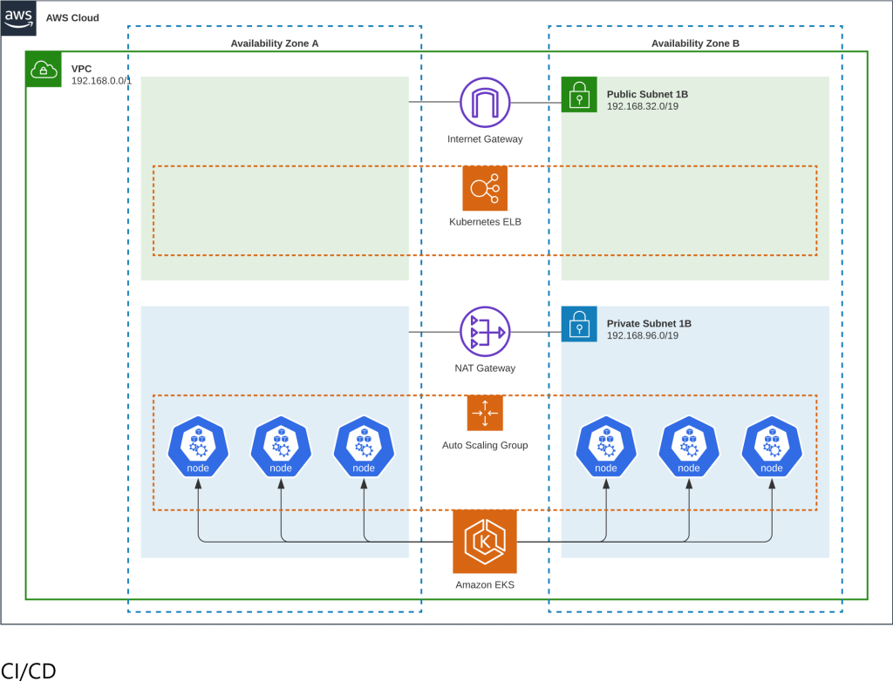
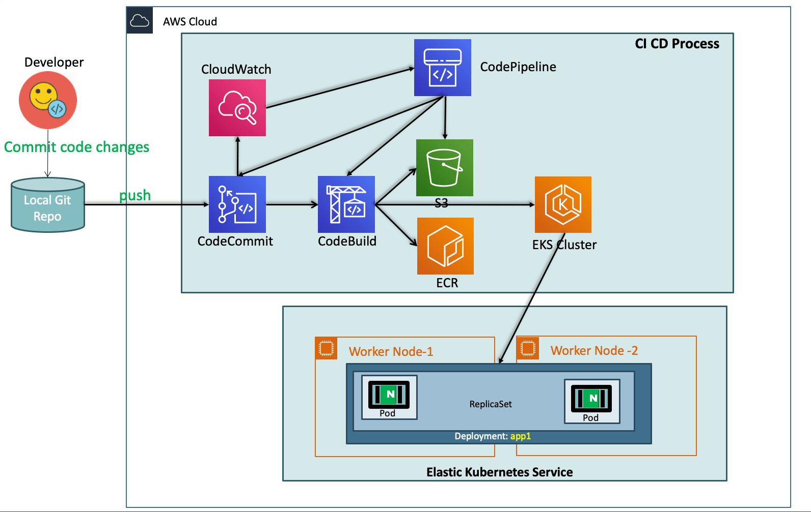

 ## Getting Started

To get started with the Authentication Service, follow the instructions below:

1. Clone the project
2. Run `npm install` to install dependencies
3. Create a `.env` file in the root directory of the folder and add the baseURL for frontend
4. Add environmental variable as the below table
5. Run `npm start` in terminal to run the program

# Login System

| Variable             | Value                                    |
| -------------------- | ---------------------------------------- |
| PORT                 | ` PORT_NUMBLER`                          |
| secretOrKey          | ` Secret_Key`                            |
| clientID             | ` GoogleConsole_OAuth_2.0_Client_IDs`    |
| clientSecret         | ` GoogleConsole_OAuth_2.0_Client_Secret` |
| callbackURL          | `  GoogleConsole_OAuth_2.0_callbackURL`  |
| GITHUB_CLIENT_ID     | ` GITHUB_Client_ID`                      |
| GITHUB_CLIENT_SECRET | `  GITHUB_Client_Secret`                 |
| GITHUB_CALLBACK_URL  | `  GITHUB_CALLBACK_URL_callbackURL`      |
| baseURL              | `  where your frontend is hosted`        |
| DB_URL               | `  MONGODB_Atlas_URL`                    |


| Variable     | Value                                    |
| ------------ | ---------------------------------------- |
| PORT         | `PORT_NUMBLER`                          |
| secretOrKey  | `Secret_Key`                            |
| clientID     | `GoogleConsole_OAuth_2.0_Client_IDs`    |
| clientSecret | `GoogleConsole_OAuth_2.0_Client_Secret` |
| callbackURL  | `GoogleConsole_OAuth_2.0_callbackURL`  |

# Terraform EKS AWS CodePipeline

This GitHub project provides a Terraform configuration to deploy an Amazon Elastic Kubernetes Service (EKS) cluster and set up an AWS CodePipeline to automate the deployment of your Kubernetes application.

## Deployment Architecture




## Prerequisites

Before running this Terraform project, make sure you have the following prerequisites set up:

1. **AWS Account**: You'll need an AWS account with appropriate permissions to create and manage resources like EKS cluster, CodePipeline, IAM roles, etc.

2. **Terraform**: Install Terraform on your local machine. You can download Terraform from the official website: [https://www.terraform.io/downloads.html](https://www.terraform.io/downloads.html).

3. **AWS CLI**: Install AWS CLI (Command Line Interface) on your local machine. You can find installation instructions in the AWS CLI User Guide: [https://docs.aws.amazon.com/cli/latest/userguide/cli-chap-install.html](https://docs.aws.amazon.com/cli/latest/userguide/cli-chap-install.html).

4. **AWS IAM Credentials**: Ensure you have AWS access and secret keys configured locally. You can generate these keys by creating an IAM user with the required permissions. Make sure the IAM user has sufficient privileges to create EKS clusters and CodePipeline resources.

5. **Kubernetes Tools**: Install `kubectl` and `aws-iam-authenticator` on your local machine to interact with the EKS cluster and authenticate with AWS IAM. Instructions for installing `kubectl` can be found in the Kubernetes documentation: [https://kubernetes.io/docs/tasks/tools/](https://kubernetes.io/docs/tasks/tools/). For `aws-iam-authenticator`, refer to the AWS documentation: [https://docs.aws.amazon.com/eks/latest/userguide/install-aws-iam-authenticator.html](https://docs.aws.amazon.com/eks/latest/userguide/install-aws-iam-authenticator.html).

## Configuration

To configure and run the Terraform project, follow these steps:

1. **Clone the Repository**: Clone this GitHub repository to your local machine using the `git clone` command or by downloading the repository as a ZIP file.

2. **Navigate to the Project Directory**: In your terminal or command prompt, navigate to the project directory that contains the cloned repository.

3. **Initialize Terraform**: Run the following command to initialize Terraform and download the necessary provider plugins:

   ```bash
   cd terraform
   terraform init
   ```

4. **Configure Variables**: The project requires certain variables to be configured. 

   Open the `variables.tf` file in a text editor and provide values for the variables. Update the variables according to your requirements.

5. **Review and Customize Configuration**: Explore the project files and customize the configuration if needed. For example, you can modify the `eks.tf` file to adjust the EKS cluster settings.

6. **GitHub Repository Details**: Open the `codepipeline.tf` file in a text editor. Inside the `source` stage, add or update the following attributes:

   - `BranchName`: Replace `<GITHUB_REPO>` with the name of your GitHub repository.
   - `FullRepositoryId`: Replace `<BRANCH_NAME>` with the branch you want to trigger the pipeline on.
   - `ConnectionArn`: Replace `<CONNECTION_ARN>` with the ARN of the connection you want to use. This connection should be previously established using the AWS CodePipeline console or the AWS CLI.

   ```hcl
   configuration = {
        BranchName = <BRANCH_NAME>
        FullRepositoryId = <GITHUB_REPO>
        ConnectionArn = <CONNECTION_ARN>
      }
      
      ...
   ```   
After completing these steps, your `codepipeline.tf` file should include the GitHub repository details and the ConnectionArn required for the AWS CodePipeline resource to function correctly.


7. **Plan and Verify Changes**: Run the following command to preview the changes Terraform will make to your infrastructure:

   ```bash
   terraform plan
   ```

   Review the output to ensure the changes align with your expectations.

8. **Deploy the Infrastructure**: Run the following command to deploy the infrastructure defined in the Terraform configuration:

   ```bash
   terraform apply
   ```

   Confirm the deployment by typing `yes` when prompted. Terraform will create the EKS cluster, associated resources, and the CodePipeline.
